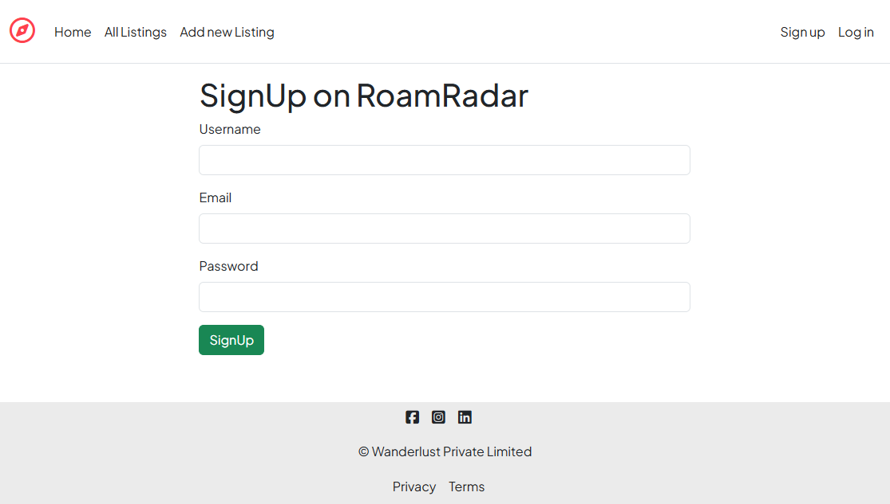
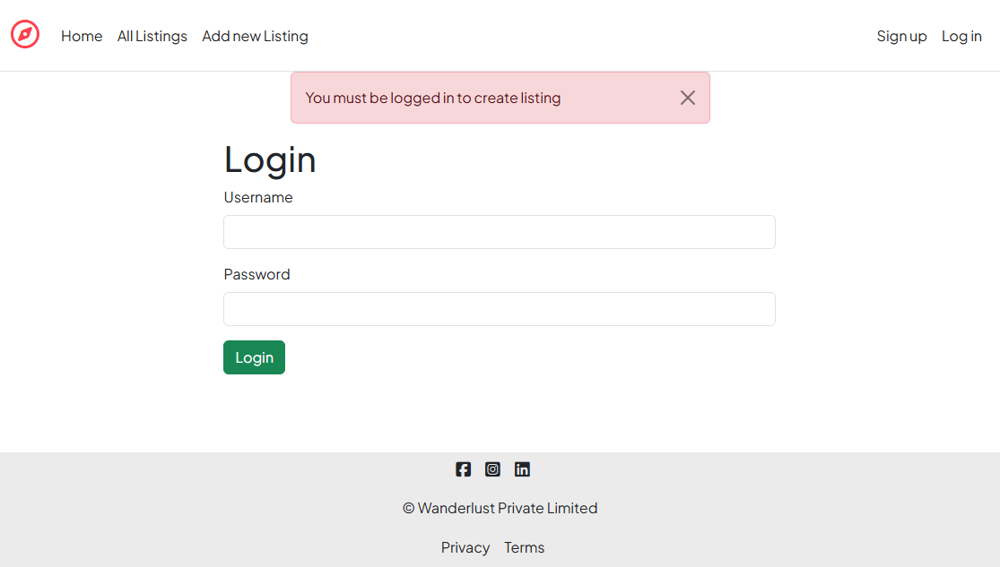
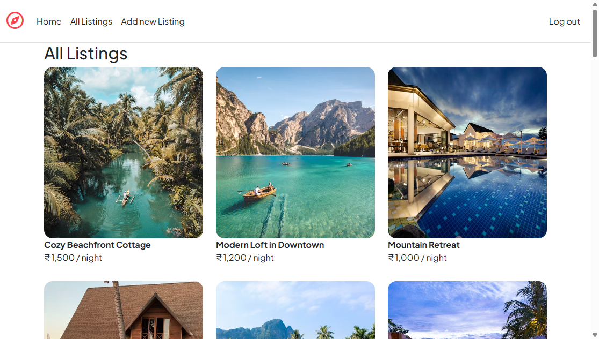
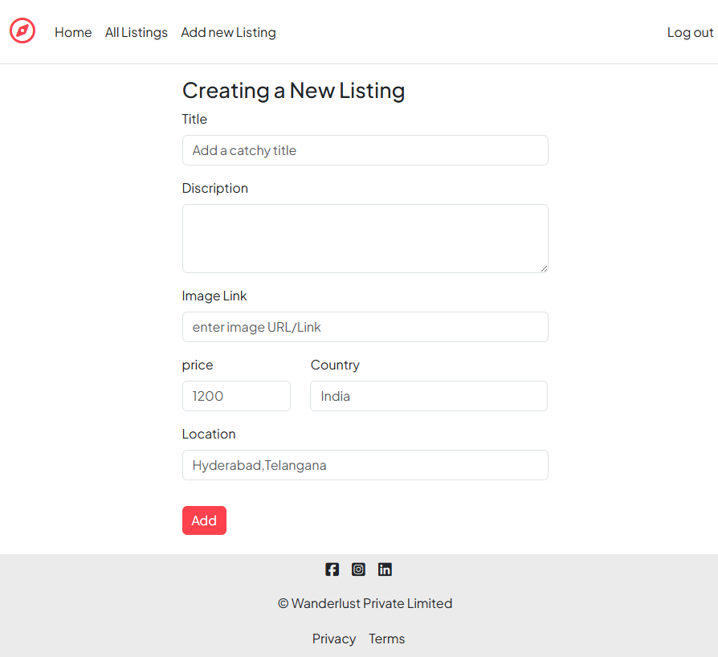
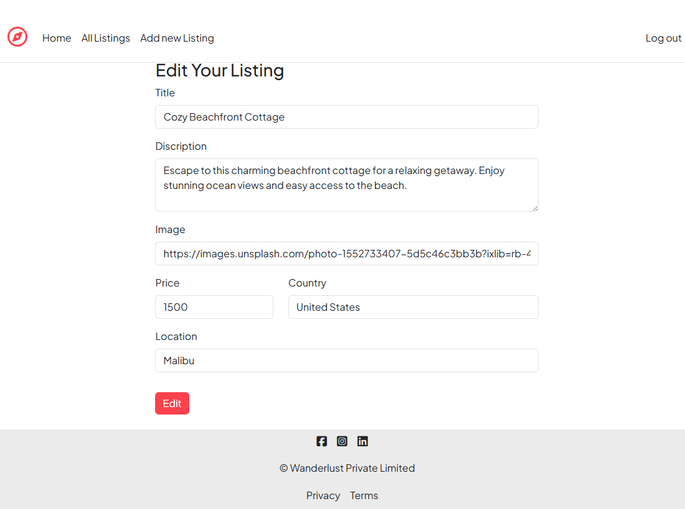
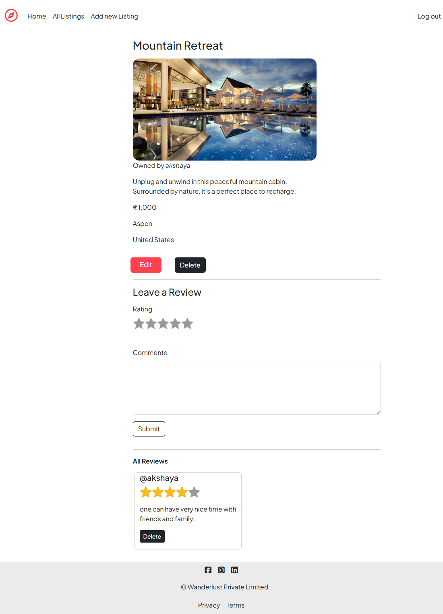

# RoamRadar – Full Stack Travel Web App


Roamradar is a full-stack travel application where users can explore destinations, create listings, and leave reviews. It’s built using the MERN stack with a focus on clean backend structure and real-world functionality. The backend is complete, and a React-based frontend is under development.

---

##  Tech Stack

- **Backend:** Node.js, Express.js  
- **Database:** MongoDB, Mongoose  
- **Frontend:** EJS (React in progress)  
- **Authentication:** Passport.js  
- **Templating:** EJS  
- **Session Management:** express-session, connect-flash

---

##  Features

- User authentication (register/login/logout)  
- Add, edit, and delete travel destinations  
- Post and manage reviews  
- Flash messages for user actions  
- MVC folder structure for scalability

---

##  Getting Started

###  Installation

```bash
git clone https://github.com/bhuvanakruthi27/roamradar.git
cd roamrador-mern-bhuvana
npm install
```

###  Run the Application

Start your server:
```bash
node app.js
```
Open your browser and visit:
[http://localhost:8080](http://localhost:8080)


##  Setup Environment Variables

- Create a .env file in the root directory of the project and add the following environment variables:
```bash
MONGO_URL=your_mongodb_connection_string
SESSION_SECRET=your_session_secret
```
- Replace the placeholder values with your actual MongoDB URI and a random session secret key.


##  Folder Structure
```bash
roamradar/
├── assets/    # Screenshots used in README
│   ├── allListings.png
│   ├── createListing.png
│   ├── editListing.png
│   ├── showListing.png
│   ├── userLogin.png
│   └── userSignup.png
├── init/       # Seed data and DB connection
│   ├── data.js
│   └── index.js
├── models/     # Mongoose models
│   ├── listing.js
│   ├── reviews.js
│   └── user.js
├── public/     # Static files (CSS, JS)
│   ├── css/
│   │   └── style.css
│   └── js/
│       └── scriptValidate.js
├── routes/      # Express routes
│   ├── listings.js
│   ├── reviews.js
│   └── user.js
├── utils/        # Helper utilities
│   ├── ExpressError.js
│   └── wrapAsync.js
├── views/         # EJS templates
│   ├── includes/
│   │   ├── flash.ejs
│   │   ├── footer.ejs
│   │   └── navbar.ejs
│   ├── layouts/
│   │   └── boilerplate.ejs
│   ├── listings/
│   │   ├── edit.ejs
│   │   ├── index.ejs
│   │   ├── new.ejs
│   │   └── show.ejs
│   ├── users/
│   │   ├── login.ejs
│   │   └── signup.ejs
│   └── error.ejs
├── .gitignore
├── app.js       # Main application file
├── middleware.js
├── package.json
├── package-lock.json
├── README.md
└── schema.js     # Joi validation schema
```


##  Screenshots

###  User Signup


###  User Login


###  All Listings Page


###  Create New Listing


###  Edit Listing


###  Show Listing Details



##  Future Enhancements

- Build the React frontend (in progress)
- Add user profile dashboard
- Make it responsive for mobile
- Add dark/light mode
- Improve performance and accessibility

## Developed By

[](https://github.com/bhuvanakruthi27)
